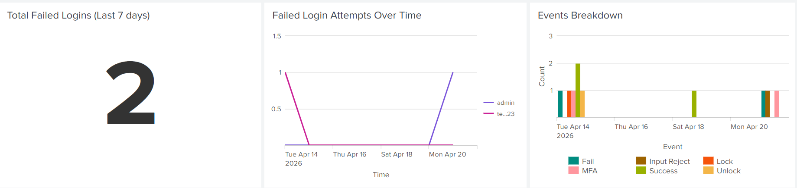

## Overview

This project implements a secure authentication system designed to monitor login activity and identify signs of potentially compromised accounts.

Detection and monitoring are primarily implemented in Splunk, while supplemental Python scripts demonstrate local detection logic and event correlation techniques. It includes features such as centralized structured JSON logging, multi-factor authentication (MFA), account lockouts, and detection of abnormal behaviours such as repeated login failures, MFA misuse, and suspicious input activity.

It simulates a Security Operations Center (SOC) workflow by generating authentication logs, ingesting them into a SIEM for analysis, and applying detection logic to identify suspicious activity.

The project demonstrates an end-to-end SOC-style detection pipeline, from authentication event generation to SIEM-based monitoring, correlation, and investigation.

## Additional Documentation

Detailed technical implementation notes and detection documentation are available in:

- `AUTH_SYSTEM.md`

## Skills Demonstrated

This project demonstrates practical skills relevant to an entry-level Security Analyst role, including:

* Log analysis
* Detection engineering
* SIEM (Splunk) usage
* Authentication security best practices
* Building and visualizing security detections in a SIEM dashboard
* Understanding SOC workflows and security event investigation processes

## Technologies Used

* Python
* Splunk Enterprise
* SQLite
* bcrypt
* pyotp (TOTP MFA)
* qrcode
* scikit-learn (experimental anomaly detection concepts)

## Getting Started

Follow these steps to run the project locally:

1. Create and activate a virtual environment:

   Windows (PowerShell):
   ```bash
   python -m venv .venv
   .\.venv\Scripts\Activate.ps1
    ```

2. Install dependencies:
   ```bash
   pip install -r requirements.txt
   ```

3. Initialize the database:
   ```bash
   python auth_project/init_db.py
   ```

4. Create an admin account:
   ```bash 
   python auth_project/create_admin.py
   ```
   This script creates the initial admin user used to manage other accounts.

   Admin accounts are required to configure MFA on first login using a TOTP authenticator application such as Google Authenticator.

5. Run the authentication system:
   ```bash
   python auth_project/auth.py
   ```
   Authentication logs will be generated in:
   ```
   logs/auth.log
   ```

   Interact with the system (e.g., login attempts, failed logins, MFA actions) to generate authentication events.

   These logs can then be ingested into Splunk for monitoring and analysis.

6. (Optional) Run the local detection monitor:
   ```bash
   python auth_project/log_summary.py
   ```

   This script continuously monitors authentication logs and generates local alerts for suspicious behaviour.

   For simplicity, the local monitoring script performs repeated analysis of the authentication log file rather than incremental log streaming.

## Setup Notes

Create a `config/auth_pepper.txt` file containing a secret value used for password hashing.

You can copy or rename `auth_pepper.txt.example` to:

`config/auth_pepper.txt`

The application expects the file to be named exactly:

`config/auth_pepper.txt`

Example:

mysecretpepper123

## Threat Model

The system is designed to simulate detection of suspicious authentication activity and potentially compromised accounts through authentication monitoring. This includes:

* Brute-force attempts (multiple failed login attempts)
* Suspicious login patterns (failed attempts followed by success)
* MFA misuse or bypass attempts
* Unauthorized configuration changes (e.g., MFA disable attempts)
* Access attempts during account lockout periods
* Simulated IP-based detections are simplified and do not use real geolocation data

## Detection Approach

### Local Detection (Python)

Custom scripts demonstrate threshold-based alerting, event correlation, and basic anomaly detection concepts using authentication log data.

* **log_summary.py**  
  Monitors authentication logs continuously, performs threshold-based detection, and demonstrates basic anomaly detection concepts using Isolation Forest for learning purposes.

* **alert.py**  
  Generates alerts when suspicious behaviour is detected and includes alert suppression logic to prevent duplicate alerts within a short time window.

These scripts demonstrate how detection logic can be implemented locally, while Splunk serves as the primary detection and monitoring platform.

### Splunk Detection (Primary)

Detection logic is primarily implemented in Splunk using SPL queries, including:

* Multiple failed login attempts
* Failed attempts followed by successful login
* Account lockouts
* MFA failures and MFA brute-force activity
* MFA disable events followed by successful logins
* Suspicious input events (INPUT_REJECT)
* Correlated behaviours such as repeated access attempts during lockout

Logs were ingested into Splunk Enterprise (trial environment) to simulate SIEM-based detection and monitoring, reflecting real-world SOC environments.

These detections are visualized in the Splunk dashboard for real-time monitoring.

## How It Works

* `init_db.py` is used to initialize the database before running the system
* `logger.py` acts as the centralized logging module, generating structured JSON authentication events with event IDs, severity levels, and simulated source IPs
* `auth.py` handles authentication, MFA, account lockouts, and user management
* Logs are stored in `logs/auth.log`
* Logs can be:

  * analyzed locally using Python scripts
  * ingested into Splunk for detection and alerting

The authentication system (`auth.py`) includes:

* Secure password hashing using bcrypt with a pepper
* Account lockout after multiple failed login attempts (3 attempts → 5-minute lockout)
* Role-based Multi-Factor Authentication (MFA):
  * Admin accounts are required to configure MFA on first login
  * Regular users can optionally enable or disable MFA
  * MFA verification is enforced if enabled
  * For simulation purposes only, MFA setup displays QR codes and secret keys to emulate onboarding flows.
  * In production systems, secrets would only be shown once and never re-displayed.

* Role-based access control (admin vs user)
* Basic suspicious input detection and logging
* Structured JSON logging with event IDs, severity levels, and source IPs (designed for SIEM ingestion)

## Log Format Example

```json
{
  "_time": "2026-04-10T12:34:56",
  "event": "LOGIN_FAIL",
  "event_id": "AUTH_002",
  "user": "admin",
  "src_ip": "192.168.1.10",
  "status": "FAILURE",
  "severity": "MEDIUM",
  "details": "wrong_password_attempt_1"
}
```

## Splunk Setup

Logs are structured in JSON format to simulate real-world SIEM ingestion pipelines and enable efficient field extraction within Splunk.

Authentication logs were ingested into Splunk Enterprise (trial environment) using a file-based data input.

A custom index was created to store authentication events, and SPL queries were used to analyze login activity and detect suspicious behaviour.

## Splunk Dashboard

A Splunk dashboard was created to monitor authentication activity and detect suspicious behaviour in real time.

The dashboard includes visualizations for:

* Failed login attempts over time
* Successful logins after multiple failures
* Account lockouts
* Top attacked users
* Top attacker IPs
* Event breakdown (LOGIN_FAIL, LOGIN_SUCCESS, MFA events, etc.)
* Suspicious input detection
* MFA activity monitoring

These visualizations simulate how a SOC analyst monitors authentication activity, identifies anomalies, and investigates potential account compromise scenarios.

## Example Dashboard Screenshots




## Project Structure

```
soc-auth-detection-lab/
├── auth_project/
│   ├── auth.py
│   ├── auth_db.py
│   ├── logger.py
│   ├── create_admin.py
│   ├── init_db.py
│   ├── log_summary.py
│   ├── users.db  # generated at runtime
│   └── alert.py
├── generated_qr/  # generated at runtime (not stored in repository)
├── config/
│   └── auth_pepper.txt.example
├── logs/
│   └── auth.log  # generated at runtime
├── screenshots/
│   ├── dashboard_overview.png
│   ├── suspicious_logins.png
│   └── event_breakdown.png
├── .gitignore
├── AUTH_SYSTEM.md
├── README.md
└── requirements.txt
```

## Limitations and Future Improvements

This project is designed for educational purposes and does not represent a production-grade authentication or detection system.

* Detection is currently focused only on authentication events
* Detection rules use simple thresholds and can be improved with more advanced logic
* Data is simulated and does not represent real attacker behaviour
* No automated alerting system (e.g., notifications or integrations)
* Geographic-based detection (e.g., impossible travel) is simplified and can be improved with real IP data
